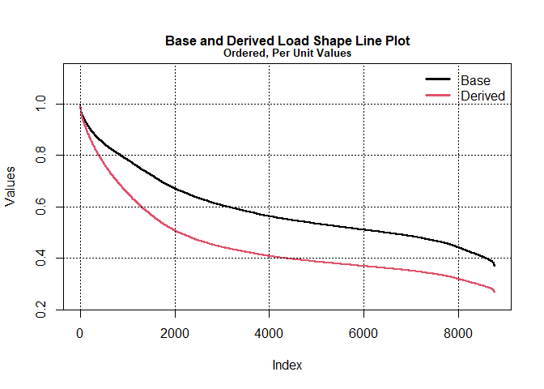
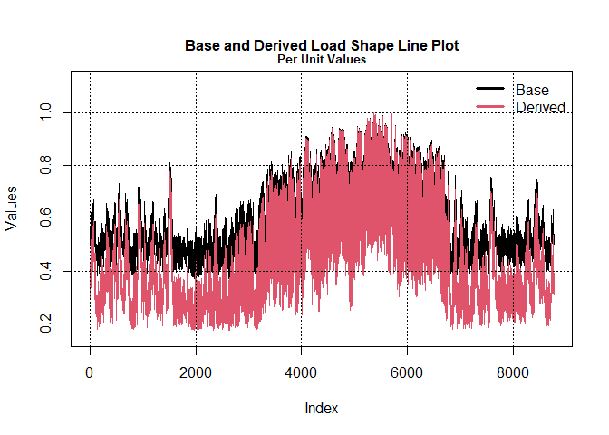

## R package loadshaper

The goal of this R package is to project a base 8760 (electric) load
shape in order to match a target peak and target energy (or, energy via
target load factor). Two methods were developed and implemented.
Generics methods like `summary`, `print`, `plot` can be applied to
certain objects. A score metric was developed and implemented to assess
the output in terms of retaining general time series property.

See [here](https://rpubs.com/riazakhan94/load_shape_match_peak_energy)
for the description of the methods.

# Example

``` r
library(loadshaper)
# base load shape
input_8760 <- ercot[ercot$Year == 2019, ]$ERCOT
pf_base <- mean(input_8760) / max(input_8760)
max_base <- max(input_8760)

message("Base Load Max:", max_base)
```

    ## Base Load Max:74665.579486

``` r
message("Base Load Power Factor:", pf_base)
```

    ## Base Load Power Factor:0.58685579458097

# Project to Different Load Factor

## Higher Load Factor, Linear method

``` r
y <- lslin(input_8760, target_max = max_base, target_lf = 0.65)
```

    ## Note: Increasing multipliers (mult) do not yield
    ##            decreasing y_ordered_pu

``` r
summary(y)
```

    ##                                           
    ##  beta : -2.79795130085659e-05             
    ##  ------------------------------------     
    ##  Maximum Multilier : 1.24507255444203     
    ##  Minimum Multilier : 1                    
    ##  ------------------------------------     
    ##  Base Shape Load Factor : 0.58685579458097
    ##  Target Load Factor : 0.65                
    ##  Derived Shape Load Factor : 0.65         
    ##  ------------------------------------     
    ##  Base Shape Peak : 74665.579486           
    ##  Target Peak : 74665.579486               
    ##  Derived Shape Peak : 74665.579486        
    ##  ------------------------------------     
    ##  Base Shape Min : 27612.054044            
    ##  Derived Shape Min : 34379.0106619544     
    ##  ------------------------------------     
    ##                                               
    ##  ====================================         
    ##  Multipliers (obj$mult) do not                
    ##  yield  decreasing obj$df$y_ordered_pu;       
    ##  Re-orderdered in  obj$df$y_ordered_pu2 which 
    ##  is used in obj$df$y_pu2 and obj$df$y2.

``` r
# Plot 
plot(y, case = 1)
```


``` r
plot(y, case = 2)
```


``` r
# Score
print(lscore(y, lag = 24))
```

    ##                         
    ##  Max. Lag :  24         
    ##  Type :  acf            
    ##  Weighted MAPE :  3.36 %

## Higher Load Factor, Logistic method

``` r
y <- lslog(input_8760, target_max = max_base, target_lf = 0.65,
           k = 0.5, inf_pos = 0.2)
```

    ## Note: Increasing multipliers (mult) do not yield
    ##            decreasing y_ordered_pu

``` r
summary(y)
```

    ##                                               
    ##  Derived Shape Min : 32384.8004423111         
    ##  Inflection position : 0.2                    
    ##  L parameter (solved) : 0.24                  
    ##  ------------------------------------         
    ##  Maximum Multilier : 1.17285010346227         
    ##  Minimum Multilier : 1                        
    ##  ------------------------------------         
    ##  Base Shape Load Factor : 0.58685579458097    
    ##  Target Load Factor : 0.65                    
    ##  Derived Shape Load Factor : 0.650086698662215
    ##  ------------------------------------         
    ##  Base Shape Peak : 74665.579486               
    ##  Target Peak : 74665.579486                   
    ##  Derived Shape Peak : 74665.579486            
    ##  ------------------------------------         
    ##  Base Shape Min : 27612.054044                
    ##  Derived Shape Min : 32384.8004423111         
    ##  ------------------------------------         
    ##                                               
    ##  ====================================         
    ##  Multipliers (obj$mult) do not                
    ##  yield  decreasing obj$df$y_ordered_pu;       
    ##  Re-orderdered in  obj$df$y_ordered_pu2 which 
    ##  is used in obj$df$y_pu2 and obj$df$y2.

``` r
# Plot 
plot(y, case = 1)
```


``` r
plot(y, case = 2)
```


``` r
# Score
print(lscore(y, lag = 24))
```

    ##                         
    ##  Max. Lag :  24         
    ##  Type :  acf            
    ##  Weighted MAPE :  1.14 %

## Smaller Load Factor, Linear method

``` r
y <- lslog(input_8760, target_max = max_base, target_lf = 0.45,
           k = 1, inf_pos = 0)
summary(y)
```

    ##                                               
    ##  Derived Shape Min : 19963.5547941862         
    ##  Inflection position : 0                      
    ##  L parameter (solved) : 0.434                 
    ##  ------------------------------------         
    ##  Maximum Multilier : 1                        
    ##  Minimum Multilier : 0.723001438515736        
    ##  ------------------------------------         
    ##  Base Shape Load Factor : 0.58685579458097    
    ##  Target Load Factor : 0.45                    
    ##  Derived Shape Load Factor : 0.450387998856635
    ##  ------------------------------------         
    ##  Base Shape Peak : 74665.579486               
    ##  Target Peak : 74665.579486                   
    ##  Derived Shape Peak : 74665.579486            
    ##  ------------------------------------         
    ##  Base Shape Min : 27612.054044                
    ##  Derived Shape Min : 19963.5547941862         
    ##  ------------------------------------         
    ##                                      
    ##  ====================================

``` r
# Plot 
plot(y, case = 1)
```



``` r
plot(y, case = 2)
```


``` r
# Score
print(lscore(y, lag = 24))
```

    ##                         
    ##  Max. Lag :  24         
    ##  Type :  acf            
    ##  Weighted MAPE :  8.91 %

## Smaller Load Factor, Logistic method

``` r
y <- lslin(input_8760, target_max = max_base, target_lf = 0.45)
summary(y)
```

    ##                                           
    ##  beta : 6.06414865681707e-05              
    ##  ------------------------------------     
    ##  Maximum Multilier : 1                    
    ##  Minimum Multilier : 0.468841219149393    
    ##  ------------------------------------     
    ##  Base Shape Load Factor : 0.58685579458097
    ##  Target Load Factor : 0.45                
    ##  Derived Shape Load Factor : 0.45         
    ##  ------------------------------------     
    ##  Base Shape Peak : 74665.579486           
    ##  Target Peak : 74665.579486               
    ##  Derived Shape Peak : 74665.579486        
    ##  ------------------------------------     
    ##  Base Shape Min : 27612.054044            
    ##  Derived Shape Min : 12945.6690812079     
    ##  ------------------------------------     
    ##                                      
    ##  ====================================

``` r
# Plot 
plot(y, case = 1)
```


``` r
plot(y, case = 2)
```



``` r
# Score
print(lscore(y, lag = 24))
```

    ##                         
    ##  Max. Lag :  24         
    ##  Type :  acf            
    ##  Weighted MAPE :  3.29 %
